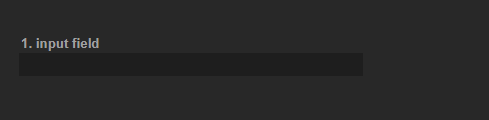
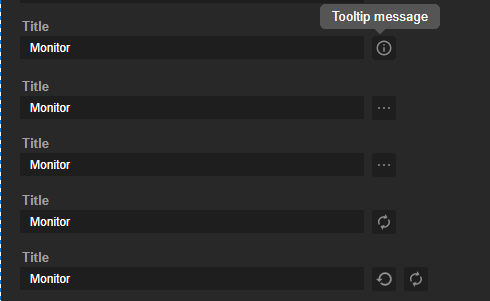
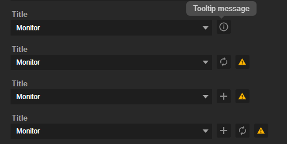
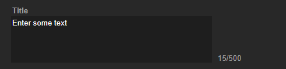
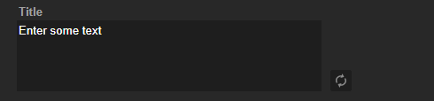
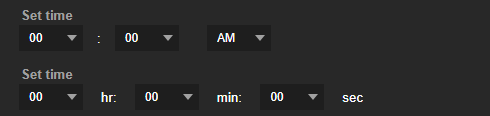

# Web Example

We recommend using our integrated CSS `avt.css`. It demonstrates all supported HTML elements.

## Getting Start

Please included stylesheet and javascript link in the `<head>` section of HTML page.

```html
<head>
    <meta charset="utf-8" />
    <title>My first plugin</title>
    <link rel="stylesheet" href="avt.css">
    <script src="js/jquery.min.js"></script>
    <script src="js/ax_socket.js"></script>
    <script src="js/main_property.js"></script>
</head>
<div class="avt-wrapper">
    ...
</div>
```

You can include our recommended css stylesheet [avt.css](css/avt.css) which contains styles of all our components.

Before you start coding javascript you need include library `jquery.min.js` and our helper file [ax_socket.js](js/ax_socket.js).

The file [ax_socket.js](js/ax_socket.js) contains a registration function and all receiving/sending event function.

For more information, you can refer to [ document Registration Flow ](https://github.com/AVerMedia-Technologies-Inc/CreatorCentralSDK/wiki/Registration-Flow).

You can create your javascript file to write the event handling and element behavior.

Here, we create the [property_main.js](js/property_main.js) as an example to do the event handling and element behavior.

There is a sample contains file [avt.css](css/avt.css), [ax_socket.js](js/ax_socket.js), [property_main.js](js/property_main.js) and all html component.

You can clone our project as a template and modify it as you wish.


## Trigger HTML

Our component needs the event [sendToPropertyView](https://github.com/AVerMedia-Technologies-Inc/CreatorCentralSDK/wiki/Send-Events-To-Creator-Central#send-to-property-view) to trigger the complete element.

The format as the following example:

```json
{
    "widget" : "com.avermedia.example.widget1",
    "event": "sendToPropertyView",
    "context": uniqueIdentifier,
    "payload": {
        
    }
}
```

You need add a subscribed function in `property_main.js` to receive the event.

```js
AVT_CREATOR_CENTRAL.on('sendToPropertyView', receive_from_widget);
```

The parameter `payload` is the content for controlling the element's value or style.

## Sending Messages to a package

To send message to package, you need add [sendToPackage](https://github.com/AVerMedia-Technologies-Inc/CreatorCentralSDK/wiki/Send-Events-To-Creator-Central#send-to-package) function in `property_main.js`. 

Examples are as follows:
```js
// ...
const sendToPackage = AVT_CREATOR_CENTRAL_API.sendToPackage;
// ...
sendToPackage({
    'action' : 'get_select_account',
    'option_id': option_id,
    'option_val': e.target.value,
});  
```

## Components

The main view is wrapped in a HTML-node with the class avt-wrapper.
```html
<div class="avt-wrapper">
    ...
    Write your content
    ...
</div>
```

### Input Field

#### Basic input



* HTML

```html
<div class="avt-item">
    <div class="avt-item-label" id="input_text_1_name">Title</div>
    <div class="input-btn-wrap">
        <input class="avt-item-value" type="text" id="input_text_1">
    </div>
</div>
```

* Javascript
```javascript
propertyEvents.on('set_input_text', data => {
    let lableItem = $('#'+data.label_name.id);
    lableItem.text(data.label_name.name);
    let oldVal = '';

    if(data.input_text) {
    let input_text = $('#' + data.input_text.id);

    if(data.input_text && data.input_text.hasOwnProperty('text')) {
        oldVal = data.input_text.text;
        input_text.val(data.input_text.text);
    }

    input_text.on("change keyup paste", function() {
            let currentVal = $(input_text).val();
            if(currentVal == oldVal) {
                return; //check to prevent multiple simultaneous triggers
            }
            oldVal = currentVal;
        });
    }
})
```

* Trigger Event

```json
{
    "event": "sendToPropertyView",
    "context": uniqueIdentifier,
    "payload": {
        "action": "set_input_text",
        "label_name": {
            "id": "input_text_1_name",
            "name": "Title"
        },
        "input_text": {
            "id": "input_text_1",
            "text": "Monitor"
        }
    }
}
```

* Payload Description
  
| Parameter       | Description                   |
| --------------- | ----------------------------- |
| action          | A action of trigger           |
| label_name      | Container of label parameters |
| label_name.id   | Indicate label id             |
| label_name.name | Indicate label text           |
| input_text      | Container of input parameters |
| input_text.id   | Indicate input id             |
| input_text.text | Indicate input text           |

#### Input with button or icon



* HTML

```html
<div class="avt-item">      
    <div class="avt-item-label" id="input_text_2_name">2.input field + Show tooltip</div>
    <div class="input-btn-wrap">
        <input class="avt-item-value" type="text" id="input_text_2">
        
        
    </div>
</div>
```

* Javascript
```javascript
propertyEvents.on('set_input_text', data => {
    // .... 

    for(let intxtbtn of ['input_text_button_1', 'input_text_button_2']) {    
        if(data.hasOwnProperty('input_text_button_1')) {
            let input_button = $('#'+data[intxtbtn].id);
            if(input_button && input_button.length > 0) {
                let visibility = (data[intxtbtn]['visibility'] && data[intxtbtn]['visibility'].match(/hidden|none|hide|false/)) ? 'hidden' : '';
                if(data[intxtbtn]['tooltip'] && !visibility) {
                    input_button.wrapAll('<span class="tooltip">');
                    input_button.after('<span class="tooltiptext">' + data[intxtbtn]['tooltip'] + '</span>');
                }
                input_button.css('visibility', visibility);
                input_button.css('opacity', 100);
                input_button = input_button[0];
                input_button.src = data[intxtbtn].src;
                if(data[intxtbtn]['action'] == 'file_upload') {
                    let upfile = input_text.next();
                    $(input_button).on('click', e => upfile.trigger('click'));
                    input_text.attr('disabled', true);
                    $(upfile).change(e => { 
                        input_text.val(upfile.val()); 
                    });
                } else {
                    $(input_button).on('click', e => {
                        // ...
                    });
                }
            }
        }
    }
})
```

* Trigger Event

```json
{
    "event": "sendToPropertyView",
    "context": uniqueIdentifier,
    "payload": {
        "action": "set_input_text",
        "label_name": {
            "id": "input_text_2_name",
            "name": "Title"
        },
        "input_text": {
            "id": "input_text_2",
            "text": "Monitor"
        },
        "input_text_button_1": {
            "id": "input_text_2_button_1",
            "src": "images/component_btn_infor_block_n.svg",
            "tooltip": "Tooltip message"
        },
        "input_text_button_2": {
            "id": "input_text_2_button_2",
            "src": "images/component_btn_refresh_block_b_n.svg"
        },
    }
}
```

* Payload Description

| Parameter                     | Description                                |
| ----------------------------- | ------------------------------------------ |
| action                        | A action of trigger                        |
| label_name                    | Container of label parameters              |
| label_name.id                 | Indicate label id                          |
| label_name.name               | Indicate label text                        |
| input_text                    | Container of input parameters              |
| input_text.id                 | Indicate input id                          |
| input_text.text               | Indicate input text                        |
| input_text_button_[n]         | Indicate a button or icon                  |
| input_text_button_[n].id      | Indicate button or icon id                 |
| input_text_button_[n].src     | Indicate a link of button or icon          |
| input_text_button_[n].tooltip | Show tooltip when hover the button or icon |

#### Input with inline style


* HTML
```html
<div class="avt-item">
    <div class="input-row">
        <div class="avt-item-label" id="input_text_row_1_name">Title side by side 1</div>
        <div class="input-btn-wrap">
        <input class="avt-item-value" type="text" id="input_text_row_1">
        
        </div>
    </div>
</div>
```

#### Input with multiple column 


* HTML
```html
<div class="avt-item">
    <div class="input-2-input-row">
        <div class="avt-item-label" id="input_text_row_2_name">Title side by side 2</div>
            <div class="input-btn-wrap">
                <div class="avt-item-sub-label" id="input_text_row_2_sub_name_1">1</div>
                <input type="text" id="input_text_row_sub_1">
                <div class="avt-item-sub-label" id="input_text_row_2_sub_name_2">2</div>
                <input type="text" id="input_text_row_sub_2">
                
                
        </div>
    </div>
</div>
```

* Trigger Event
```json
{
    "event": "sendToPropertyView",
    "context": uniqueIdentifier,
    "payload": {
        "action": "set_input_text",
        "label_name": {
            "id": "input_text_row_2_name",
            "name": "Size"
        },
        "label_name_1": {
            "id": "input_text_row_2_sub_name_1",
            "name": "W"
        },
        "label_name_2": {
            "id": "input_text_row_2_sub_name_2",
            "name": "H"
        },
        "input_text_1": {
            "id": "input_text_row_sub_1",
            "text": "800"
        },
        "input_text_2": {
            "id": "input_text_row_sub_2",
            "text": "600"
        },
        "input_text_button_1": {
            "id": "input_text_row_2_button_1",
            "src": "images/component_btn_restore_block_b_n.svg"
        },
        "input_text_button_2": {
            "id": "input_text_row_2_button_2",
            "src": "images/component_btn_restore_block_b_n.svg"
        }
    }
}
```

### Combobox

#### Basic Combobox


* HTML

```html
<div class="avt-item">
    <div class="avt-first-item-label" id="select_1_name">Title</div>
    <select class="avt-item-value select" id="select_1_options"></select>
</div>
```

* Javascript
  

```javascript
propertyEvents.on('set_select_item', data => {
    $('#'+data.select_name.id).text(data.select_name.name);
    let option_id = data.select_options.id;
    let select_option = $('#'+option_id);
    let options = data.select_options.options;

    select_option.html('');

    for(let i=0; i < options.length; i++) {
        select_option.append('<option value="' + options[i].value + '">' + options[i].name + '</option>');
    }
    if(data.select_options.hasOwnProperty('default_value')) {
        select_option.val(data.select_options.default_value);
    }

})
```

* Trigger Event

```json
{
    "event": "sendToPropertyView",
    "context": uniqueIdentifier,
    "payload": {
        "action": "set_select_item",
        "select_name": {
            "id": "select_1_name",
            "name": "Title"
        },
        "select_options": {
            "id": "select_1_options",
            "options": [
                {
                    "value": "monitor",
                    "name": "Monitor"
                },
                {
                    "value": "select-1-value-1",
                    "name": "Combobox-1-option-1"
                },
                {
                    "value": "select-1-value-2",
                    "name": "Combobox-1-option-2"
                },
                {
                    "value": "select-1-value-3",
                    "name": "Combobox-1-option-3"
                }
            ]
        }
    }
}
```


* Payload Description

| Parameter                       | Description                            |
| ------------------------------- | -------------------------------------- |
| action                          | A action of trigger                    |
| select_name                     | Container of select label parameters   |
| select_name.id                  | Indicate select label id               |
| select_name.name                | Indicate select label text             |
| select_options                  | Container of select options parameters |
| select_options.id               | Indicate select id                     |
| select_options.options          | Container of select options            |
| select_options.options[i].value | Indicate options value                 |
| select_options.options[i].name  | Indicate options text                  |


#### Combobox with file browsing


* HTML

```html
<div class="avt-item">
    <div class="avt-item-label" id="select_1_name">3.Combobox  + file browsing </div>
    <div class="select-btn-wrap">
        <select class="avt-item-value select" id="select_1_options"></select>
        <input class="avt-item-value" type="file" style="display:none">
    </div>      
</div>
```

* Javascript
```javascript
propertyEvents.on('set_select_item', data => {
    // ...

    if(data['select_button_1']['action'] == 'file_upload') {
        let upfile = select_option.next();
        $(select_button).on('click', e => upfile.trigger('click'));
        $(upfile).change(e => { 
            let file = upfile.val();
            if($(select_option).find('option[value="' + file +'"]').length == 0) {
                select_option.append('<option value="'+ file +'">' + file + '</option>');
            }
            select_option.val(file); 
        });
    }

})
```

* Trigger Event

```json
{
    "event": "sendToPropertyView",
    "context": uniqueIdentifier,
    "payload": {
        "action": "set_select_item",
        "select_name": {
            "id": "select_1_name",
            "name": "Title"
        },
        "select_options": {
            "id": "select_1_options",
            "options": [...]
        },
        "select_button_1": {
            "id": "select_1_button_1",
            "src": "images/component_btn_point_block_b_n.svg",
            "action": "file_upload"
        }
    }
}
```
* Payload Description

| Parameter                       | Description                             |
| ------------------------------- | --------------------------------------- |
| action                          | A action of trigger                     |
| select_name                     | Container of select label parameters    |
| select_name.id                  | Indicate select label id                |
| select_name.name                | Indicate select label text              |
| select_options                  | Container of select options parameters  |
| select_options.id               | Indicate select id                      |
| select_options.options          | Container of select options             |
| select_options.options[i].value | Indicate options value                  |
| select_options.options[i].name  | Indicate options text                   |
| select_button_[n]               | Indicate select item button or icon     |
| select_button_[n].id            | Indicate button or icon id              |
| select_button_[n].src           | Indicate a image link of button or icon |
| select_button_[n].action        | Assign a action to button or icon       |

#### Combobox with button or icon



* HTML

```html
<div class="avt-item">
    <div class="avt-item-label" id="select_7_name">Title</div>
    <div class="select-btn-wrap">
        <select class="avt-item-value select" id="select_7_options"></select>
        
        
        
    </div>  
</div>
```

* Javascript

```javascript
propertyEvents.on('set_select_item', data => {
    ...

    for(let selbtn of ['select_button_1', 'select_button_2', 'select_button_3']) {
        if(data.hasOwnProperty(selbtn)) {
            let select_button = $('#'+data[selbtn].id);
            if(select_button && select_button.length > 0) {
                let visibility = (data[selbtn]['visibility'] && data[selbtn]['visibility'].match(/hidden|none|hide|false/)) ? 'hidden' : '';
                if(data[selbtn]['tooltip'] && !visibility) {
                    select_button.wrapAll('<span class="tooltip">');
                    select_button.after('<span class="tooltiptext">' + data[selbtn]['tooltip'] + '</span>');
                }
                select_button.css('visibility', visibility);
                select_button.css('opacity', 100);
                select_button = select_button[0];
                select_button.src = data[selbtn].src;

                $(select_button).on('click', e => {
                    console.log('click changed', e.target); 
                });
            }
        }
    }

})
```

* Trigger Event

```json
{
    "event": "sendToPropertyView",
    "context": uniqueIdentifier,
    "payload": {
        "action": "set_select_item",
        "select_name": {
            "id": "select_7_name",
            "name": "Title"
        },
        "select_options": {
            "id": "select_7_options",
            "options": [...]
        },
        "select_button_1": {
            "id": "select_7_button_1",
            "src": "images/component_btn_addnew_block_b_n.svg",
            "tooltip": "Tooltip message"
        },
        "select_button_2": {
            "id": "select_7_button_2",
            "src": "images/component_btn_refresh_block_b_n.svg"
        },
        "select_button_3": {
            "id": "select_7_button_3",
            "src": "images/component_btn_fault.svg"
        }
    }
}
```

* Payload Description

| Parameter                       | Description                                |
| ------------------------------- | ------------------------------------------ |
| action                          | A action of trigger                        |
| select_name                     | Container of select label parameters       |
| select_name.id                  | Indicate select label id                   |
| select_name.name                | Indicate select label text                 |
| select_options                  | Container of select options parameters     |
| select_options.id               | Indicate select id                         |
| select_options.options          | Container of select options                |
| select_options.options[i].value | Indicate options value                     |
| select_options.options[i].name  | Indicate options text                      |
| select_button_[n]               | Indicate select item button or icon        |
| select_button_[n].id            | Indicate button or icon id                 |
| select_button_[n].src           | Indicate a image link of button or icon    |
| select_button_[n].tooltip       | Show tooltip when hover the button or icon |


### Radio


* HTML
```html
<div class="avt-item">
    <div class="avt-item-label" id="radio_1_name">Radio button - Choose one from three(Toggle) </div>
    <div class="avt-item-value radio_wrap" id="radio_1_options"></div>
</div>
```

* Javascript

```javascript
propertyEvents.on('set_radio_button', data => {
    
    $('#'+data.radio_name.id).text(data.radio_name.name);
    let radio_id = data.radio_options.id;
    let radio_option = $('#'+radio_id);

    radio_option.html('');

    let options = data.radio_options.options;
    for(let i=0; i < options.length; i++) {
        radio_option.append('<label class="avt-item-label"><input type="radio" name="' + data.radio_options.id + '" value="' + options[i].value + '">' + options[i].name + '</input></label>');
    }

    if(data.radio_options.hasOwnProperty('default_value')) {
        $('input:radio[name="' + radio_id + '"]').filter('[value="' + data.radio_options.default_value + '"]').attr('checked', true);
    }

    radio_option.on('change', e => {
        let radio_val = $('input[name="' + radio_id + '"]:checked').val(); 
    });

})
```

* Trigger Event

```json
{
    "event": "sendToPropertyView",
    "context": uniqueIdentifier,
    "payload": {
        "action": "set_radio_button",
        "radio_name": {
            "id": "radio_1_name",
            "name": "radio name"
        },
        "radio_options": {
            "id": "radio_1_options",
            "default_value": "radio-1-value-2",
            "options": [
                {
                    "value": "radio-1-value-1",
                    "name": "Toggle"
                },
                {
                    "value": "radio-1-value-2",
                    "name": "On"
                },
                {
                    "value": "radio-1-value-3",
                    "name": "Off"
                }
            ]
        }
    }
}
```

* Payload Description

| Parameter                      | Description                           |
| ------------------------------ | ------------------------------------- |
| action                         | A action of trigger                   |
| radio_name                     | Container of radio label parameters   |
| radio_name.id                  | Indicate radio label id               |
| radio_name.name                | Indicate radio label text             |
| radio_options                  | Container of radio options parameters |
| radio_options.id               | Indicate radio id                     |
| radio_options.options          | Container of radio options            |
| radio_options.options[i].value | Indicate options value                |
| radio_options.options[i].name  | Indicate options text                 |


### Checkbox


* HTML
```html
<div class="avt-item">
    <div class="avt-item-label" id="checkbox_1_name">Transition</div>
    <label class="avt-checkbox" id="checkbox_1">
      <input type="checkbox">
      <span>Override transition if already in scene</span>
    </label>
</div>
```

* Javascript

```javascript
propertyEvents.on('set_checkbox', data => {
    $('#' + data.checkbox.id + ' > span').text(data.checkbox.name);
    let checkbox = $('#' + data.checkbox.id + ' > input[type="checkbox"]');
    let checked = (data.checkbox.checked?true:false);
    checkbox.prop("checked", checked);

    checkbox.on('click', e => {
        // ...
    });
})
```

* Trigger Event

```json
{
    "event": "sendToPropertyView",
    "context": uniqueIdentifier,
    "payload": {
        "action": "set_checkbox",
        "checkbox": {
            "id": "checkbox_1",
            "name": "Override transition if already in scene",
            "checked": true
        }
    }
}
```

* Payload Description

| Parameter        | Description                            |
| ---------------- | -------------------------------------- |
| action           | A action of trigger                    |
| checkbox         | Container of checkbox label parameters |
| checkbox.id      | Indicate checkbox label id             |
| checkbox.name    | Indicate checkbox label text           |
| checkbox.checked | Set checkbox checked status            |

### Textarea

#### Textarea with text length limit



* HTML
```html
<div class="avt-item">
    <div class="avt-item-label" id="texteditor_1_name">text area + character limit</div>
    <div id="texteditor_1" class="texteditor-row-wrap">
        <textarea rows="3" cols="40"></textarea>
    </div>
</div>
```

* Javascript

```javascript
propertyEvents.on('set_texteditor', data => {
    $('#' + data.label_name.id).text(data.label_name.name);
    let textItem = $('#' + data.texteditor.id);
    let texteditor = $('#' + data.texteditor.id + ' > textarea');
    let oldVal = "";

    if(data.texteditor.hasOwnProperty('text')) {
        texteditor.val(data.texteditor.text);
    }

    if(data.texteditor.hasOwnProperty('max_length')) {
        texteditor.attr('maxlength', data.texteditor.max_length);
        textItem.find('.avt-item-value-helper').remove();
        texteditor.after('<label class="avt-item-value-helper">'+ texteditor.val().length + '/' + data.texteditor.max_length +'</label>');
    }

    texteditor.on("change keyup paste", function() {
        let currentVal = $(texteditor).val();
        if(currentVal == oldVal) {
            return; //check to prevent multiple simultaneous triggers
        }
        oldVal = currentVal;
        textItem.find('.avt-item-value-helper').text((currentVal.length + '/' + data.texteditor.max_length));
    });

});
```

* Trigger Event

```json
{
    "event": "sendToPropertyView",
    "context": uniqueIdentifier,
    "payload": {
        "action": "set_texteditor",
        "label_name": {
            "id": "texteditor_1_name",
            "name": "Title"
        },
        "texteditor": {
            "id": "texteditor_1",
            "text": "Enter some text",
            "max_length": 500
        }
    }
}
```

* Payload Description

| Parameter             | Description                        |
| --------------------- | ---------------------------------- |
| action                | A action of trigger                |
| label_name            | Container of label parameters      |
| label_name.id         | Indicate label id                  |
| label_name.name       | Indicate label text                |
| texteditor            | Container of texteditor parameters |
| texteditor.id         | Indicate texteditor id             |
| texteditor.text       | Indicate texteditor text           |
| texteditor.max_length | Set texteditor text length limit   |

#### Textarea with button or icon



* HTML
```html
<div class="avt-item">
    <div class="avt-item-label" id="texteditor_2_name">text area + toolbar</div>
    <div id="texteditor_2" class="texteditor-row-wrap">
        <textarea rows="3" cols="40"></textarea>
        
    </div>
</div>
```

* Javascript

```javascript
propertyEvents.on('set_texteditor', data => {
    // ....

    for (const key in data) {
        if (key.includes('set_texteditor_button')) {
            let input_button = $('#'+data[key].id);
            if(input_button && input_button.length > 0) {
                let visibility = (data[key]['visibility'] && data[key]['visibility'].match(/hidden|none|hide|false/)) ? 'hidden' : '';
                if(data[key]['tooltip'] && !visibility) {
                    input_button.wrapAll('<span class="tooltip">');
                    input_button.after('<span class="tooltiptext">' + data[key]['tooltip'] + '</span>');
                }
                input_button.css('visibility', visibility);
                input_button.css('opacity', 100);
                input_button = input_button[0];
                input_button.src = data[key].src;
                $(input_button).on('click', e => {
                    ....
                });
            }
            
        }
    }

});
```

* Trigger Event

```json
{
    "event": "sendToPropertyView",
    "context": uniqueIdentifier,
    "payload": {
        "action": "set_texteditor",
        "label_name": {
            "id": "texteditor_2_name",
            "name": "Title"
        },
        "texteditor": {
            "id": "texteditor_2",
            "text": "Enter some text"
        },
        "set_texteditor_button": {
            "id": "texteditor_text_3_button_2",
            "src": "images/component_btn_refresh_block_b_n.svg"
        }
    }
}
```

* Payload Description

| Parameter             | Description                        |
| --------------------- | ---------------------------------- |
| action                | A action of trigger                |
| label_name            | Container of label parameters      |
| label_name.id         | Indicate label id                  |
| label_name.name       | Indicate label text                |
| texteditor            | Container of texteditor parameters |
| texteditor.id         | Indicate texteditor id             |

### Integrated elements

#### Timer


* HTML

```html
<div class="avt-item">
    <div class="avt-item-label" id="timer12_1_name">time input-1</div>
    <div class="set-timer-12" id="timer12_1">
        <select class="avt-item-value time_collection select"></select>
        <div class="">:</div>
        <select class="avt-item-value time_collection select"></select>
        <div class=""></div>
        <select class="avt-item-value time_collection select">
        <option value="AM">AM</option>
        <option value="PM">PM</option>
        </select>
    </div>      
</div>
<div class="avt-item">
    <div class="avt-item-label" id="timer24_1_name">time input-2</div>
    <div class="set-timer-24" id="timer24_1">
        <select class="avt-item-value time_collection select"></select>
        <div class="">hr:</div>
        <select class="avt-item-value time_collection select"></select>
        <div class="">min:</div>
        <select class="avt-item-value time_collection select"></select>
        <div class="">sec</div>
    </div>
</div>
```

* Javascript
```javascript
function setTimerSelectOptions(select, bound){ 
    for(let i=0; i < bound; i++){
        if(i < 10){
            select.append(`<option value="0${i}">0${i}</option>`);
        }else{
            select.append(`<option value="${i}">${i}</option>`);
        }
    };
} 

propertyEvents.on('set_timer', data => {
    let lableItem = $('#'+data.label_name.id);
    lableItem.text(data.label_name.name);

    let hr, min, sec, ampm;
    let type = data.type;
    let timer = $('#' + data.timer.id + ' select.time_collection');
    if(+type == 12) {
        hr = $(timer[0]);
        setTimerSelectOptions(hr, 13);
        if(data.timer['hr']) { 
            hr.val(data.timer['hr']); 
        }
        min = $(timer[1]);
        setTimerSelectOptions(min, 60);
        if(data.timer['min']) { 
            min.val(data.timer['min']); 
        }
        ampm = $(timer[2]); 
        if(data.timer['ampm']) { 
            ampm.val(data.timer['ampm']); 
        }
        
        for(let timer_item of [hr, min, ampm]) {
            timer_item.change(e => {
                ....
            });
        }
    } else {
        hr = $(timer[0]);
        setTimerSelectOptions(hr, 24);
        if(data.timer['hr']) { 
            hr.val(data.timer['hr']); 
        }
        min = $(timer[1]);
        setTimerSelectOptions(min, 60);
        if(data.timer['min']) { 
            min.val(data.timer['min']); 
        }
        sec = $(timer[2]); 
        setTimerSelectOptions(sec, 60);
        if(data.timer['sec']) { 
            sec.val(data.timer['sec']); 
        }
        for(let timer_item of [hr, min, sec]) {
            timer_item.change(e => {
                ....
            });
        }
    }
});
```


* Trigger Event
```json
{
    "event": "sendToPropertyView",
    "context": uniqueIdentifier,
    "payload": {
        "action": "set_timer",
        "type": 12,
        "label_name": {
            "id": "timer12_1_name",
            "name": "Set time"
        },
        "timer": {
            "id": "timer12_1"
        }
    }
}
```

* Payload Description

| Parameter       | Description                        |
| --------------- | ---------------------------------- |
| action          | A action of trigger                |
| type            | Set 24-hour clock or 12-hour clock |
| label_name      | Container of label parameters      |
| label_name.id   | Indicate label id                  |
| label_name.name | Indicate label text                |
| timer           | Container of timer parameters      |
| timer.id        | Indicate timer id                  |


